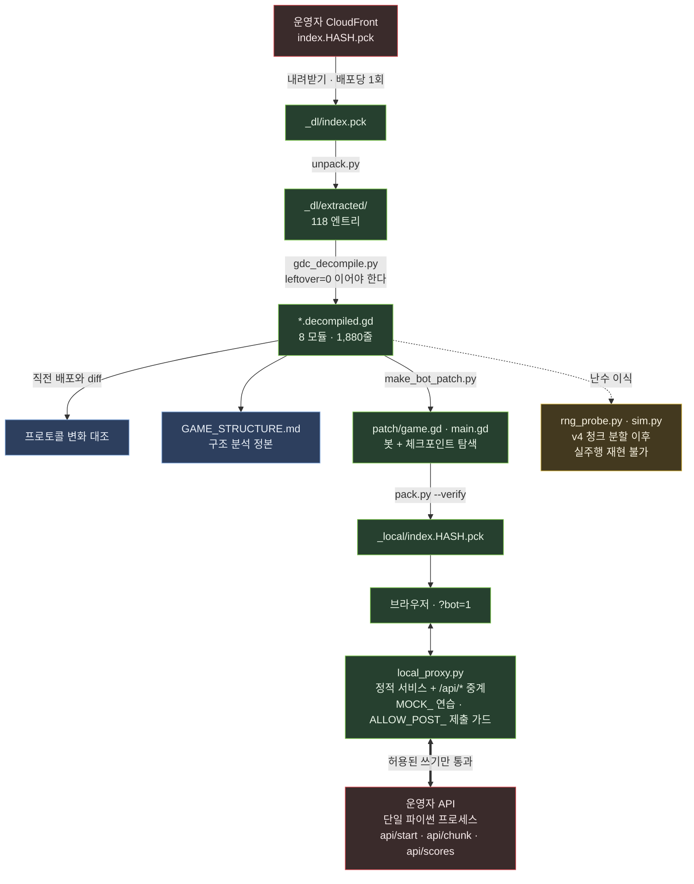

# hack-jeongho

브라우저 게임 **고라니 피하기**(Godot 4.7.1 HTML5, 640×960)를 배포된 `.pck` 하나에서
출발해 역공학한 기록이다. 게임 소스 **1,880줄을 토큰 단위로 100% 복원**하고, 소스가 없는
랭킹 서버의 검증 규칙을 응답만 보고 실측으로 확정한 뒤, **그 서버가 스스로 재현해 확인하는
점수를 실제로 등록했다.** 운영자는 그 사이 클라이언트를 다섯 번 재배포하며 막았고, 그
대응 과정이 이 저장소의 절반이다.

최종 결과는 리더보드 1~4위이고, 마지막 주행은 **948행을 실제로 건넜다.** 부풀린 값이
아니라 서버가 시드로 월드를 다시 만들고 입력 트레이스를 재생해 직접 계산한 값이다.

> **범위.** 공개 배포된 클라이언트 파일과 공개 랭킹 API만 다뤘다. 인증 우회, 서버 침투,
> 타인 데이터 접근, 남의 기록 변경은 없다(그런 엔드포인트는 API에 존재하지도 않는다).
> 쓰기 요청은 규칙 확정에 필요한 최소로 제한하고 전부
> [`docs/submissions-log.md`](docs/submissions-log.md)에 감사 기록으로 남겼다.
> 상대는 파이썬 프로세스 하나로 돌아가는 서버다 —
> [아래 "요청을 센다"](#요청을-센다) 참조.

---

## 결과

| 순위 | score / rows | stage | 서버 판정 | 방법 |
|---|---|---|---|---|
| **1** | **1002 / 948** | 47 | `verified` · `rep 0` | 체크포인트 탐색, 청크 2~38 청원 |
| 2 | 700 / 654 | 32 | `verified` · `rep 0` | 같음 |
| 3 | 600 / 556 | 27 | `verified` · `rep 0` | 같음 |
| 4 | 500 / 466 | 23 | `verified` · `rep 0` | 같음 |

네 항목 모두 중복 0, 부풀림 0이다. 1위 주행 단독으로 `api/chunk` **37건 / 실제 `403` 0건**,
닷새 누적 **275건 / 실제 `403` 1건**.

비교 기준: 사람의 최고 기록은 `민지 401점`이고, **완전정보 봇의 1회 주행 최대 도달은
354행**이다([`docs/autopilot.md`](docs/autopilot.md) §6). 화면 밖 장애물의 좌표와 속도를
전부 알고 60분의 1초마다 최적 경로를 다시 계산해도 한 번에 달려서는 사람을 못 넘는다 —
450행 무사고 통과 확률은 정직하게 곱해지기 때문이다. 그 벽을 넘은 것이 체크포인트 탐색이다.

배포된 `.pck` 하나에서 얻은 것은 네 가지다.

1. **게임 전체 소스** — `.gdc`(GDScript 바이너리 토큰) 8개를 원본 줄번호까지 보존해 복원 → `recovered/`
2. **게임 구조 분석** — 점수 산식, 난이도 곡선과 그 상한, 사망 판정, 서버 계약 → [`GAME_STRUCTURE.md`](GAME_STRUCTURE.md) (1,222줄, 모든 수치에 `file.gd:LINE` 인용)
3. **서버 검증 규칙** — 응답 문자열과 통과·거부 경계만 관측해 유도 → [`docs/leaderboard-api.md`](docs/leaderboard-api.md)
4. **재패킹한 자동 조종** — `.pck`에 봇과 탐색 하네스를 심어 실제로 주행 → `patch/`, [`docs/autopilot.md`](docs/autopilot.md)

---

## 파이프라인

배포마다 이 경로를 처음부터 다시 밟는다. 운영자가 하루에 여러 번 재배포하므로 어제의
복원 결과로 추론하면 틀린 결론이 나온다.



제출 가드가 **게임 밖 프록시에** 있는 것이 의도된 설계다. 게임 안의 봇이 무엇을 하려 해도
조건에 맞지 않는 `POST`는 중계되지 않는다 — 라이브 서버에 회수 불가능한 항목을 남기는
사고는 게임 코드를 믿는 방식으로는 막을 수 없다.

---

## 서버가 막는 방식 (프로토콜 v5)

소스가 공개되지 않은 서버다. 아래는 전부 응답 관측으로 유도한 것이다.

| 관문 | 내용 | 도입 |
|---|---|---|
| ① 바디 지문 | `POST` 바디가 Godot `JSON.stringify` 형태(**키 정렬 + 공백 없음**)여야 한다. 아니면 `403 rejected / hint: stale` | 08-13 밤 |
| ② 재현 검증 | 서버가 `api/start` 시드로 월드를 다시 만들고 제출된 `trace`를 재생해 **`rows`와 `score`를 직접 계산한다.** 클라이언트가 보낸 값은 쓰지 않는다 | 08-14 02:16 (v3) |
| ③ 청크 시드 | 월드 시드가 **25행 단위**로 쪼개져, 앞 청크를 실제로 통과해야 다음 시드를 `POST api/chunk`로 받는다. **오프라인 선계산 불가** | 08-14 22:04 (v4) |
| ④ 대기·토큰 | 시드를 **15초** 안에 못 받으면 그 판은 영구 `unranked`. 토큰은 **600초**가 지나면 재발급된다 | 08-15 08:28 (v5) |
| ⑤ 요청 스로틀 | `api/chunk`·`api/scores` 모두 IP 단위 `429 too fast` | v5에서 `api/chunk`까지 확대 |
| ⑥ `rep` 배지 | `verified`와 **별개로** 항목마다 어뷰징 판정(0 정상 ~ 3 봇 의심)과 이유 문구를 붙인다 | 08-14 저녁 (서버 측) |

**실질적 의미: 점수는 실제로 행을 건너서만 나온다.** 남은 자유도는 "얼마나 잘 플레이하는가"
하나뿐이다. ②가 들어온 뒤 `score`를 부풀린 제출은 전부 거부됐다 — 같은 클라이언트에서
`503 / rows 240`과 `200 / rows 85`가 `403`, 정직한 `200 / rows 188`이 통과했다.

v5에서 흥미로운 일이 하나 있었다. 운영자가 청크 대기를 `_sim_tick` 맨 위로 옮겨 **틱을
통째로 얼리게** 고쳤는데, 그것은 우리가 v4에서 "행 생성을 한 틱이라도 늦추면 서버의 재현과
갈라진다"는 것을 알아내고 손으로 만들어 넣었던 조건과 정확히 같다. 서로 막으려 하는 쪽이
같은 답을 낸 것이고, 덕분에 하네스가 오히려 단순해졌다
([`docs/leaderboard-api.md`](docs/leaderboard-api.md) §11).

---

## 기술적으로 어려웠던 세 가지

### 1. 바이너리 토큰에서 소스로 — `leftover = 0`

`.gdc`는 Godot가 GDScript를 토큰화한 것이다. 식별자·상수·줄맵·토큰의 선언 개수만큼 정확히
소비하고 남는 바이트가 `leftover`인데, **8개 파일 전부 0**이다. 이것이 복원이 토큰 단위로
완전하다는 근거다. 디컴파일러를 고쳐 `leftover`가 0이 아니게 되면 그 출력은 신뢰할 수 없다.

`token_lines`/`token_columns`가 팩에 남아 있어서 복원 소스의 줄번호가 원본과 일치한다 —
그래서 [`GAME_STRUCTURE.md`](GAME_STRUCTURE.md)의 모든 `file.gd:LINE` 인용이 원본을 가리킨다.
독립적으로 작성된 두 개의 디컴파일러 출력이 토큰 단위로 일치한 것이 교차검증이 됐다.

### 2. Godot 4.7.1 난수 이식 — 세 개의 함정

월드를 파이썬으로 재현하려면 엔진 난수를 정확히 옮겨야 한다. `4.7.1-stable` 소스와 6건의
정답지(`tools/rng_probe.py`, `exit 0`)에 맞추기까지 세 번 틀렸다.

1. **`rng.seed = N`은 `state = N`이 아니다.** `pcg32_srandom_r`이 state를 0에서 시작해 한 번
   굴리고 seed를 더하고 또 굴린다. 그래서 `seed 0`이 `randf() == 0.0`을 주지 않는다 — 이
   관측이 문제 전체를 드러냈다.
2. **`randf()`가 `rand()`를 두 번 쓴다.** `ldexp((float)(rand() | 0x80000001), -32 - clz32(proto))`.
   이걸 틀리면 시딩이 아무리 맞아도 첫 값 이후 전부 갈라진다.
3. **`randi_range`는 거부 표본**(`pcg32_boundedrand_r`)이다. 2의 거듭제곱에서는 나머지 연산과
   같고 9·7·6·5·3에서 다르다 — 월드 생성 코드가 하필 그 숫자들을 쓴다. `randi_range(a, a)`는
   난수를 **소비하지 않는다.**

여기서 가장 값비쌌던 것은 기술이 아니라 방법이었다. 이전 세션이 **정답 시딩을 이미 시험해
보고 배제 표에 지웠다** — 틀린 `randf` 구현으로 시험했기 때문에 통과할 수가 없었던 것이다.
공유 가정이 틀리면 배제 표 전체가 무효다([`docs/wt-notes/wt-rng.md`](docs/wt-notes/wt-rng.md)
의 7×3 격자).

### 3. 곱셈을 덧셈으로 — 체크포인트 탐색

이 세계는 **시드 하나와 입력 순서만의 함수**다. 같은 시드에 같은 입력을 넣으면 완전히 같은
세계가 나온다. 그렇다면 죽기 전까지의 입력을 다시 넣어 죽기 직전 상태를 복원하고, 거기서
다른 갈래로 이어 붙일 수 있다.

"450행을 한 번에"가 "10~20행씩 여러 번"이 된다. 무사고 확률의 **곱셈이 덧셈으로 바뀐다.**
이것이 완전정보 봇의 354행 벽과 948행 사이의 차이 전부다
([`docs/autopilot.md`](docs/autopilot.md) §8·§11).

대가가 있다. 서버는 청크를 줄 때마다 트레이스를 처음부터 재생하므로 이미 **하나의 과거를
인정한 상태**인데, 되감기는 그 인정 지점보다 아래로 내려갈 수 있다. 그러면 다음에 내미는
것은 다른 과거다. 그래서 서버가 인정한 트레이스를 **앵커**로 고정하고 매 회차가 그것을
연장하도록 강제한다. 다만 이 가설은 **반증되지 않았을 뿐 확증되지 않았다** — 앵커를 위반하는
요청이 서버에 도달한 적이 없기 때문이다.

---

## 여기서 얻은 방법론

이 저장소에서 실제로 비용을 치르고 배운 것들이다. 대상 게임과 무관하게 남는 부분이다.

### 로그가 "저쪽이 거부함"과 "내가 안 보냄"을 구분하지 못한다

사흘 동안 "청크 게이트가 닫혔다"는 이론을 세우고, 22시간 냉각 실측을 붙이고, 정본 문서와
커밋 메시지에 적었다. 원인은 서버가 아니었다. 서버 시계가 브라우저보다 1초 빨라 **토큰
나이가 음수**가 됐고, 그러면 페이싱 게이트를 건너뛰어 포기 스톱워치가 먼저 눌렸다.
프록시 로그에는 **요청이 아예 없었다.** 문이 잠긴 게 아니라 노크를 한 적이 없었다.

같은 종류의 유령을 셋 잡았다. 상수 두 개의 불일치(`포기 5초 < 요청 간격 6초`)로 요청을
보내기 전에 포기하던 것, 그리고 원인을 끝까지 못 찾아 우회한 것 하나. 세 번째는 **원본이
부르는 함수를 원본이 넘기는 인자로 직접 호출**하는 것으로 넘어갔다 — 원인을 못 찾으면
우회할 수 있는지 본다.

> **게임 로그를 정사로 쓰지 않는다. 프록시 로그가 정사다.** 거절을 세기 전에 요청이 실제로
> 나갔는지 확인한다.

### "불가능"은 이 저장소에서 가장 비싼 결론이었다

1000점은 935행이 필요한데 관측 최고가 654행, 중앙값 470행이었다. 분포의 꼬리 밖이므로
구조적으로 닫혀 있다고 **계산해서** 결론 내고 문서에 적었다. 숫자는 전부 맞았다.

그런데 **그 분포가 위의 유령 거부로 잘려 나간 주행들로 만들어져 있었다.** 유령 둘을 더 잡은
직후 같은 봇이 첫 주행에 948행을 갔다.

> **포기하는 계산은 시작하는 계산보다 더 엄격해야 한다.** 분포를 근거로 "불가능"을 말하기
> 전에 그 분포가 무엇으로 만들어졌는지 확인한다.

### 한 번의 GET을 증거로 삼지 않는다

`GET api/scores`가 고득점 항목 11개가 빠진 목록을 돌려줬다. "운영자가 지웠다"로 읽혔지만,
저장해 둔 스냅샷과 레코드 단위로 대조하니 **같은 목록이 오프셋만 밀린 것**
(`filtered[0:39] == full[11:50]`)이었고 2분 뒤 원상복구됐다. CloudFront가 `no-cache`
응답의 낡은 사본을 주는 동작이었다. 재폴링도 증거가 아니다 — 같은 URL이니 같은 낡은 사본이
온다. **캐시 버스터를 붙이고, 스냅샷과 대조한 뒤에 판단한다.**

그 사이 시작했던 재등록은 첫 `POST` 90초 전에 중단했다. 밀어붙였다면 회수 불가능한 항목을
하나 더 남겼을 것이다(삭제 엔드포인트가 없다).

### 요청을 센다

상대는 파이썬 프로세스 **하나**로 돌아가는 서버다. `/api/*`가 `no-cache`라 CDN이 흡수해
주지도 않는다.

원본 클라이언트는 청크를 기다리는 동안 **매 틱** 재요청하고, 빠른 `403`/`429`가 대기 플래그를
즉시 지우기 때문에 초당 8건이 나간다. 어느 날 아침 청크 하나에 **275건**을 쏟았다. 간격
제한을 되살려 같은 벽이 3건이 됐다. **거절당한 요청도 센다 — 그쪽이 더 비쌀 수 있다.**

그리고 이 버그는 **잘 되는 서버에서는 원리적으로 보이지 않는다.** 항상 허가하는 모의 서버에서
요청은 청크당 1건이다. 그래서 실주행 전 관문에 **일부러 벽을 세운 모의**(`MOCK_CHUNK_MAX`)가
들어 있다. 안전장치를 뺄 때는 그것이 막던 상황을 만들어 본다.

### 목표에 못 닿는 경우의 출구를 먼저 만든다

630행 / 681점을 실제로 통과한 주행이 등록되지 않고 버려졌다. 코드에 "목표 777점에 도달하면
등록한다"고만 적혀 있었고, 기록은 브라우저 메모리에만 있었다. 사흘 뒤 같은 사고를 한 번 더
냈다 — 이번에는 하한을 **내 판단으로** 사용자가 정한 기준 위로 올려서 621점을 버렸다.

> 비싼 일회성 자원을 쓰기 전에 차선을 살리는 분기를 먼저 만든다. 그리고 **남이 정한 기준을
> 내 판단으로 올리지 않는다.**

### 병행 세션은 서로를 제3자로 오인한다

같은 시각 두 세션이 같은 워크스페이스·같은 포트·같은 출처 IP를 공유한 채 같은 목표를
독립적으로 진행했다. 서로가 남긴 리더보드 항목을 각각 "제3자의 침입"으로 기록했고, 한쪽이
프록시를 점유해 **다른 쪽 주행에 모의 응답을 먹이는** 사고가 났다. 보드 항목의 귀속은 점수가
아니라 **토큰 발급 epoch과 `ts`를 대조해서** 정정했다.

작업 시작 전에 `pgrep -f local_proxy.py`로 점유를 확인한다.

### 원인을 단정하지 않는다

`rep 2`(위조 이력 의심)의 원인으로 닉네임 전과, IP, `api/chunk` 호출을 각각 단정했고
**세 번 단정해서 세 번 틀렸다.** 배제된 것만 말하는 편이 낫다. 부수적으로, 원인을 모르는
상태에서 "닉네임이 없으면 위험하지 않다"는 검증하지 않은 전제로 **합성 트레이스를 보낸** 적이
있다(`tools/chunk_probe.py`) — 그 파일은 하지 말아야 할 일의 기록으로 남겨 뒀다.

---

## 저장소 구성

```
GAME_STRUCTURE.md   게임 구조 분석 정본. 모든 수치에 file.gd:LINE 인용
CLAUDE.md           이 워크스페이스에서 작업할 때의 규칙과 함정
unpacked_manifest.txt   pck 엔트리 목록 (08-15 빌드 file_count=118. 08-12에는 110개였다)
recovered/          복원한 게임 스크립트 8개 — 2026-08-12 스냅샷, 복원 기록으로 보존
                    (라이브 소스는 _dl/extracted/. 여기서 추론하면 틀린 결론이 나온다)
patch/              복원 소스에 봇을 끼운 것 — pck에 다시 심는 평문 스크립트
                    bot_game(봇 본체) · bot_main(시작·재시도·토큰) · bot_search(탐색 하네스)
docs/               leaderboard-api(서버 규칙 §1~§12) · autopilot(봇·탐색·§12 체크리스트)
                    submissions-log(쓰기 요청 감사 기록 A~L) · toolchain(포맷과 절차)
                    wt-notes/(RNG 배제표 등) · snapshots/(리더보드 원본 응답)
tools/              파이프라인 전체. 아래 표 참조
_dl/                다운로드 작업 디렉터리 (index.pck·extracted/ 는 gitignore)
_local/             로컬 서비스용 클라이언트 사본. 엔진·정적 자산은 커밋한다 —
                    배포마다 바뀌지 않으므로 새로 클론해도 pck 하나만 내려받으면 된다
```

| `tools/` | |
|---|---|
| `unpack.py` · `pack.py` | GDPC 언팩 / 재패커. `pack.py --verify`가 원본 바이트 복원을 검증한다 |
| `gdc_decompile.py` | `.gdc` 디컴파일러. `leftover=0`이 복원 완전성의 근거다 |
| `make_bot_patch.py` | 디컴파일 원본에 봇을 합성 (원본 줄은 건드리지 않는다) |
| `local_proxy.py` | 로컬 서비스 + `/api/*` 중계. 연습 모의(`MOCK_*`)와 제출 가드(`ALLOW_POST_*`) |
| `rng_probe.py` | Godot 4.7.1 난수 판정 — 시딩 7종 × `randf` 3종 격자. `exit 0`이어야 한다 |
| `watch_gate.py` | 배포·시드·보드 변화 감시 (읽기 전용) |
| `inspect_assets.py` | `project.binary` 설정 + 스프라이트·오디오 목록 |
| `sim.py` · `solve.py` | 월드 시뮬레이션과 빔 탐색 — 단일 시드 모델이라 v4 이후 실주행 불가 |
| `board_probe.py` · `submit_target.py` · `submit_run.py` | 08-14 이전 규칙 측정용 제출 프로브 (역사). `submit_target.godot_json()`이 바디 직렬화 정본이다 |
| `chunk_probe.py` | `api/chunk` 프로브. **합성 trace를 보낸 기록** — 헤더를 먼저 읽을 것 |
| `js/autopilot.js` | 브라우저 콘솔용 초기 시제품 (Emscripten이 `fetch`를 미리 잡아 실패) |

---

## 재현

**Python 3.14+ 필요** — `gdc_decompile.py`가 `from compression import zstd`(3.14 stdlib)를 쓴다.
`.pck` 파일명은 **배포마다 바뀐다**(내용 주소). 하드코딩하지 말고 페이지에서 읽는다.

```bash
# 0. 다음 배포와 비교할 기준을 먼저 남긴다 — unpack.py 가 extracted/ 를 갈아엎는다
mkdir -p _local/prev_decomp && cp _dl/extracted/scripts/*.decompiled.gd _local/prev_decomp/

# 1. 현재 배포된 pck 이름을 페이지에서 읽어 내려받는다
cd _dl && curl -s "https://d15csla760jzen.cloudfront.net/?cb=$RANDOM" -o index.html
PCK=$(grep -o 'index\.[0-9a-f]*\.pck' index.html | head -1)
curl -s "https://d15csla760jzen.cloudfront.net/$PCK?cb=$RANDOM" -o index.pck

# 2. 언팩 → 디컴파일 → 직전 빌드와 diff (프로토콜 변화가 여기서 보인다)
rm -rf extracted && python3 unpack.py > ../unpacked_manifest.txt
cd extracted/scripts && python3 ../../gdc_decompile.py *.gdc     # leftover=0 이 8개여야 한다
cd ../../.. && for f in game main player ranking row sfx theme_defs ui; do
  diff -u _local/prev_decomp/$f.decompiled.gd _dl/extracted/scripts/$f.decompiled.gd; done
```

점수를 등록하려면 실제로 플레이해야 한다. **관문 다섯 개를 통과한 뒤에 실서버로 간다** —
순서와 통과 기준은 [`docs/autopilot.md`](docs/autopilot.md) §12에 있다.

```bash
PCK=$(grep -o 'index\.[0-9a-f]*\.pck' _dl/index.html | head -1)

python3 tools/rng_probe.py          # 난수 이식 정답지 (exit 0)
python3 tools/pack.py --verify      # 원본 재패킹 → 바이트 동일 (포맷 검증)
python3 tools/make_bot_patch.py     # 디컴파일 결과 + 봇 → patch/{game,main}.gd
python3 tools/pack.py -o _local/$PCK \
        --text scripts/game.gd=patch/game.gd --text scripts/main.gd=patch/main.gd
#   _local/index.html의 fileSizes를 새 pck 크기로 고칠 것

# 연습 (실서버 무접촉). 마지막 것은 청크 벽을 모의해 요청 총량을 확인하는 관문이다
MOCK_START=1 MOCK_CHUNK_WINDOW=1 BLOCK_POST=1 PORT=8810 python3 tools/local_proxy.py
MOCK_START=1 MOCK_CHUNK_WINDOW=1 MOCK_CHUNK_MAX=8 BLOCK_POST=1 PORT=8814 python3 tools/local_proxy.py
#   관문: /?bot=1&sv=1&bt=120&sspd=25      재생 동일성 + 변이 재생
#   연습: /?bot=1&ss=1&bt=520&sfloor=500&sspd=60&sttl=300

# 본 주행. 제출 가드는 게임 밖에 둔다 — 조건에 맞지 않는 POST는 중계하지 않는다
ALLOW_POST_NAME=<닉네임> ALLOW_POST_MIN_SCORE=<하한> PORT=8816 python3 tools/local_proxy.py
#   /?bot=1&ss=1&bt=500&sfloor=400&sspd=60&sttl=300&bn=<닉네임>&bsub=1&bchar=peccy
```

시작 전에 **`pgrep -f local_proxy.py`로 다른 세션의 점유를 확인한다.**

---

## 이력 — 무엇이 언제 닫혔나

| 시점 | 변화 | 닫힌 것 |
|---|---|---|
| 08-12 | (v1~v2) 정적 복원 완료. 서버는 `rows`/토큰 나이 비율과 `score ≤ rows×2+40`만 검사 | — |
| 08-13 밤 | 바디 직렬화 지문 | 파이썬 기본 `json.dumps`로는 아무것도 통과하지 않는다 |
| 08-14 02:16 | (v3) 시드로 `trace` 재현, `rows`·`score`를 서버가 계산 | **대기 시간으로 점수를 사는 전략 전체** |
| 08-14 저녁 | `rep` 배지 (서버 측) | — |
| 08-14 22:04 | (v4) 월드 시드를 25행 청크로 분할 | 오프라인 선계산 (`sim.py`·`solve.py` 경로) |
| 08-15 08:28 | (v5) 청크 대기를 게임 안으로, 토큰 신선도 600초 | — (오히려 하네스가 단순해졌다) |
| 08-15 21:03 | 청크 요청 500ms 스로틀 | 우리가 같은 날 아침에 고친 것과 같은 버그 |

**08-14 이전의 규칙은 역사다.** 그때는 `403 too_fast`가 `score`가 아니라 **`rows`**를 보고
있었고(`score 10001 / rows 5001`이 565.6초에 통과 vs `120점 / rows 120`이 12.3초에 거부),
두 검사를 합치면 `score_max ≈ 18.8 × 경과초 + 40`이었다. 즉 `rows`를 점수의 절반으로 두면
대기가 절반이 된다 — 이 한 가지를 몰랐던 세션이 같은 목표를 "26분이나 걸린다"며 포기했다.
상세는 [`docs/leaderboard-api.md`](docs/leaderboard-api.md) §1~§5.

부수적으로, 보드에 `admin_insert: true` 키가 붙은 항목이 관측됐다. 클라이언트가 보내지 않는
키이므로 **운영자에게 POST 검증을 우회하는 삽입 경로가 있다.** 검증 규칙을 유도할 때 이런
항목은 표본에서 제외해야 한다.

---

## 한계와 공개에 관하여

- **소스가 없는 서버를 다뤘다.** 여기 적힌 규칙은 전부 관측에서 유도한 것이고, 운영자는
  하루에 여러 번 재배포한다. 실주행 전에 [`docs/autopilot.md`](docs/autopilot.md) §12를 밟는다.
- **주석은 복원할 수 없다.** 토크나이저가 저장하지 않으므로, 개발자 의도에 대한 서술은 전부
  코드 동작에서 유도한 추론이다. `GAME_STRUCTURE.md`는 그럴 때마다 "추정"으로 표시한다.
- **삭제 엔드포인트가 없다.** 등록한 기록은 회수할 수 없으므로 남은 항목도 그대로 적어 뒀다.
- ⚠ **`recovered/`·`patch/`·`_local/`·`_dl/`은 게임 저작자의 저작물에서 파생된다.** 복원한
  GDScript, 엔진 바이너리(`index.wasm`), 스프라이트 PNG가 들어 있다. **그래서 이 저장소는
  private으로 유지한다.** 공개하려면 그 디렉터리들을 먼저 제거하고 분석 문서와 툴체인만
  남겨야 한다 — 문서와 `tools/`는 우리가 작성한 것이다.
